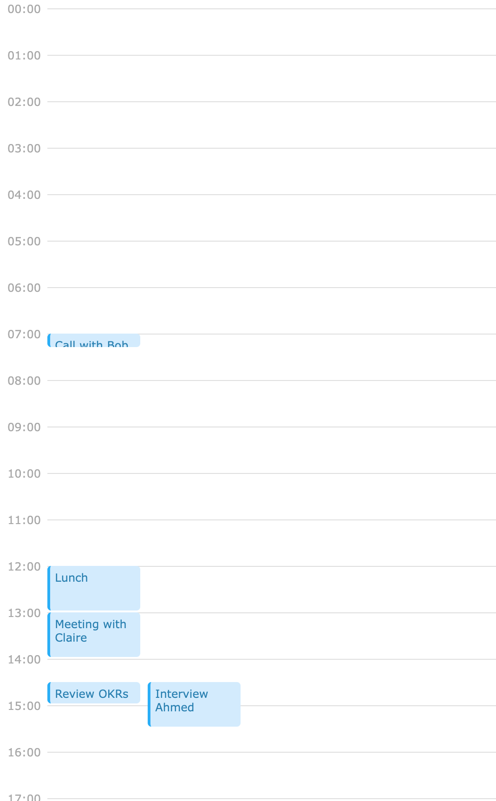
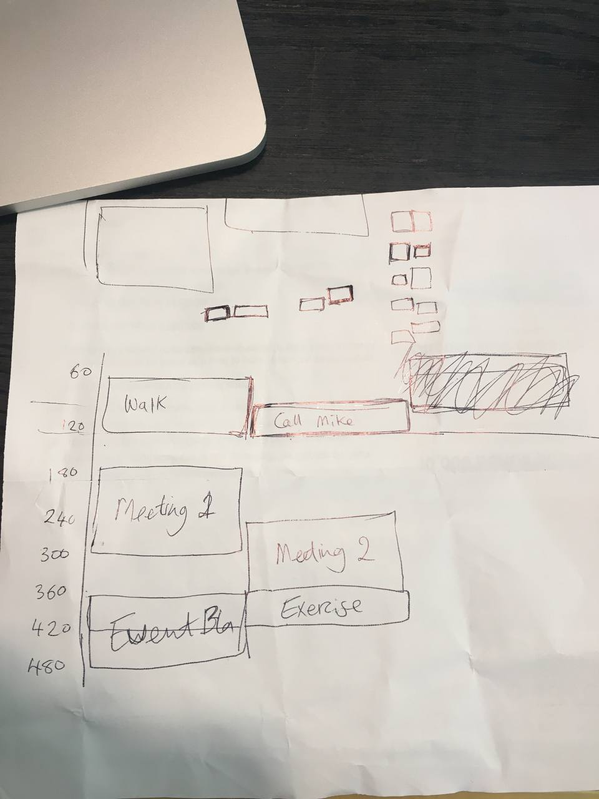

#### What is this repo about?
This is a technical test submission for a job I applied to. The task was to build a simple one day calendar that renders events fetched from a GraphQL server. The trickiest part is making sure overlapping events should render next to each other and not actually overlap.

#### What choices did you make and why?
The logic that positions the event blocks to avoid overlapping hides all events on the calendar (with `display: none`) on initial render. It shows them one by one as they are positioned correctly. This is because before we show an event block, we find out which events it overlaps with. The logic then figures out the correct position based on the event blocks visible on the calendar already. This is to avoid any flashing where you see an event block have an initial position and then quickly get changed.

I've separated components and types into separate files so the code is cleaner and easier to deal. Plus, it's easy to unit test.

I've placed the logic that finds the correct position for an event block and the overlapping events into seperate utility functions. This is so the code is cleaner to work with and easy to test.

I started with styling the UI first to get everything ready

I wrote most of the logic before writing any tests for two reasons:
  - I'm used to this pattern (maybe because I'm impatient?)
  - I use the browser to verify my assumptions and make sure the logic works as expected. This is especially true for when I was trying to get the event blocks to position correctly without overlapping.

I used SCSS because it's easier to organise my styles

I used Jest to unit tests most of the logic

The unit test files are by the files they're testing with the format <same-file-name.test.ts(x)>. This makes it easy to find those files instead of burying them inside a `tests` folder that mirrors the same folder structure.

I kept the `fetcher()` function inside the `index.tsx` file as I feel it's overkil to move it to a separate file because it's only being used there. If this was a bigger application, I'd move it.

#### What challenges did you face?
The logic that handles the positioning of event blocks so they don't overlap was the most challening. What's funny is I didn't realise this was a tricky part. I thought "A calendar? Sure I'll do this no problems." While I was styling the CSS and thinking about how the CSS is going to affect the positioning, it hit me!

I got the old pen and paper and started drawing a calendar to make sense of the logic. I was trying to figure out how I can write logic that tells me something overlaps another. Drawing helped because I don't need to imagine a calendar while thinking, I just use the visuals to think about the logic.

#### What tradeoffs did you choose?
I did not unit test the logic that calculates the left position of an event block because it was not possible to do. It's a bit tricky and since I've spent a lot of time on this, I'm going to skip this. If I was to spend time on such a tricky task, I'd look into a better approach to test this behaviour as it's quite important to the app. I may realise that it's easier to test this via functional tests using Cypress for example.

#### What do you like and not like about your solution?
I really like how the event blocks position themselves accordingly so they don't overlap. I haven't tested this app with many events to see where it breaks.

The app doesn't have a lot of code for me to be critical, but I'm waiting for your feedback :)

#### What areas would you work on next?
- Add unit tests for <Index /> component and mock the `fetcher()` function to make sure this component actually does the fetch and renders the events
- Sort overlapping events so they are ordered by height (a nice to have maybe)
- Place a nice loading spinner
- Try to show a week calendar instead of one day
- Clicking an event block that shows a small popup with more details
- Adding/Editing/Deleting events
- Basically incrementally add features that a calendar would have, otherwise this list would be much longer ;)

#### How to run
1) Build the app first
`npm build`
2) Then run
`npm start`

#### Tests
To run all tests
`npm run test`

To run tests in watch mode
`npm run test:watch`
